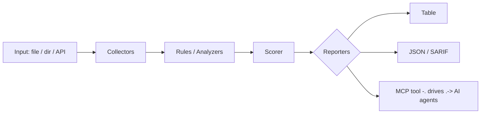

<a name="top"></a>
<div align="center">


# DMARCAUDIT

### Grade SPF/DKIM/DMARC posture & spoofability from DNS records


[](#install--every-way-every-platform) [](https://github.com/cognis-digital/dmarcaudit/actions) [](LICENSE) [](https://github.com/cognis-digital)

*Part of the Cognis Neural Suite.*

</div>

```bash
pip install "git+https://github.com/cognis-digital/dmarcaudit.git"
dmarcaudit scan .            # → prioritized findings in seconds
```

<!-- cognis:layman:start -->
## What is this?

dmarcaudit checks whether your domain's email security settings are properly configured to stop spammers and scammers from sending fake emails that appear to come from you. You give it your domain's DNS records (SPF, DKIM, and DMARC — the three standards email providers use to verify mail is legitimate), and it gives you a letter grade, a list of specific problems, and exact steps to fix each one. It works offline, runs from the command line in seconds, and is aimed at developers, sysadmins, and security teams who need a quick, no-frills way to audit and harden their email posture.
<!-- cognis:layman:end -->

## Contents

- [Why dmarcaudit?](#why) · [Features](#features) · [Quick start](#quick-start) · [Example](#example) · [Architecture](#architecture) · [AI stack](#ai-stack) · [How it compares](#how-it-compares) · [Integrations](#integrations) · [Install anywhere](#install-anywhere) · [Related](#related) · [Contributing](#contributing)

<a name="why"></a>
## Why dmarcaudit?

Grade SPF/DKIM/DMARC posture & spoofability from DNS records — without standing up heavyweight infrastructure.

`dmarcaudit` is single-purpose, scriptable, and self-hostable: point it at a target, get prioritized results in the format your workflow already speaks (table · JSON · SARIF), gate CI on it, and let agents drive it over MCP.

<div align="right"><a href="#top">↑ back to top</a></div>

<a name="features"></a>
## Features

- ✅ Parse Spf
- ✅ Parse Dmarc
- ✅ Parse Dkim
- ✅ Grade
- ✅ Audit Domain
- ✅ Runs on Linux/macOS/Windows · Docker · devcontainer
- ✅ Ports in Python, JavaScript, Go, and Rust (`ports/`)

<div align="right"><a href="#top">↑ back to top</a></div>

<a name="quick-start"></a>
<!-- cognis:install:start -->
## Install

`dmarcaudit` is source-available (not published to PyPI) — every method below installs
straight from GitHub. Pick whichever you prefer; the one-line scripts auto-detect
the best tool available on your machine.

**One-liner (Linux / macOS):**
```sh
curl -fsSL https://raw.githubusercontent.com/cognis-digital/dmarcaudit/HEAD/install.sh | sh
```

**One-liner (Windows PowerShell):**
```powershell
irm https://raw.githubusercontent.com/cognis-digital/dmarcaudit/HEAD/install.ps1 | iex
```

**Or install manually — any one of:**
```sh
pipx install "git+https://github.com/cognis-digital/dmarcaudit.git"     # isolated (recommended)
uv tool install "git+https://github.com/cognis-digital/dmarcaudit.git"  # uv
pip install "git+https://github.com/cognis-digital/dmarcaudit.git"      # pip
```

**From source:**
```sh
git clone https://github.com/cognis-digital/dmarcaudit.git
cd dmarcaudit && pip install .
```

Then run:
```sh
dmarcaudit --help
```
<!-- cognis:install:end -->

## Quick start

```bash
pip install "git+https://github.com/cognis-digital/dmarcaudit.git"
dmarcaudit --version
dmarcaudit scan .                       # scan current project
dmarcaudit scan . --format json         # machine-readable
dmarcaudit scan . --fail-on high        # CI gate (non-zero exit)
```

<div align="right"><a href="#top">↑ back to top</a></div>

<a name="example"></a>
## Example

```text
$ dmarcaudit scan .
  [HIGH    ] DMA-001  example finding             (./src/app.py)
  [MEDIUM  ] DMA-002  another signal              (./config.yaml)

  2 findings · risk score 5 · 38ms
```

<div align="right"><a href="#top">↑ back to top</a></div>

<a name="architecture"></a>
## Architecture



<div align="right"><a href="#top">↑ back to top</a></div>

<a name="ai-stack"></a>
## Use it from any AI stack

`dmarcaudit` is interoperable with every popular way of using AI:

- **MCP server** — `dmarcaudit mcp` (Claude Desktop, Cursor, Cognis.Studio, [uncensored-fleet](https://github.com/cognis-digital/uncensored-fleet))
- **OpenAI-compatible / JSON** — pipe `dmarcaudit scan . --format json` into any agent or LLM
- **LangChain · CrewAI · AutoGen · LlamaIndex** — wrap the CLI/JSON as a tool in one line
- **CI / scripts** — exit codes + SARIF for non-AI pipelines

<div align="right"><a href="#top">↑ back to top</a></div>

<a name="how-it-compares"></a>
## How it compares

| | **Cognis dmarcaudit** | typical tools |
|---|:---:|:---:|
| Self-hostable, no account | ✅ | varies |
| Single command, zero config | ✅ | ⚠️ |
| JSON + SARIF for CI | ✅ | varies |
| MCP-native (AI agents) | ✅ | ❌ |
| Polyglot ports (JS/Go/Rust) | ✅ | ❌ |
| Open license | ✅ COCL | varies |
<div align="right"><a href="#top">↑ back to top</a></div>

<a name="integrations"></a>
## Integrations

Pipes into your stack: **SARIF** for code-scanning, **JSON** for anything, an **MCP server** (`dmarcaudit mcp`) for AI agents, and a webhook forwarder for SIEM/Slack/Jira. See [`docs/INTEGRATIONS.md`](docs/INTEGRATIONS.md).

<div align="right"><a href="#top">↑ back to top</a></div>

<a name="install-anywhere"></a>
## Install — every way, every platform

```bash
pip install "git+https://github.com/cognis-digital/dmarcaudit.git"    # pip (works today)
pipx install "git+https://github.com/cognis-digital/dmarcaudit.git"   # isolated CLI
uv tool install "git+https://github.com/cognis-digital/dmarcaudit.git" # uv
pip install cognis-dmarcaudit                                          # PyPI (when published)
docker run --rm ghcr.io/cognis-digital/dmarcaudit:latest --help        # Docker
brew install cognis-digital/tap/dmarcaudit                             # Homebrew tap
curl -fsSL https://raw.githubusercontent.com/cognis-digital/dmarcaudit/main/install.sh | sh
```

| Linux | macOS | Windows | Docker | Cloud |
|---|---|---|---|---|
| `scripts/setup-linux.sh` | `scripts/setup-macos.sh` | `scripts/setup-windows.ps1` | `docker run ghcr.io/cognis-digital/dmarcaudit` | [DEPLOY.md](docs/DEPLOY.md) (AWS/Azure/GCP/k8s) |

<div align="right"><a href="#top">↑ back to top</a></div>

<a name="related"></a>
<a name="verification"></a>
## Verification

[](AUDIT.md)

Every push is verified end-to-end. Latest audit (2026-06-13):

```text
tests        : 13 passed, 0 failed, 0 errored
compile      : all modules parse
cli          : C:\Python314\python.exe: No module named https
package      : https
```

<details><summary>CLI surface (<code>--help</code>)</summary>

```text
C:\Python314\python.exe: No module named https
```
</details>

Full machine-readable results: [`AUDIT.md`](AUDIT.md) · regenerate with `python -m https --help` + `pytest -q`.

<div align="right"><a href="#top">↑ back to top</a></div>


## Related Cognis tools


**Explore the suite →** [🗂️ all 170+ tools](https://github.com/cognis-digital/cognis-neural-suite) · [⭐ awesome-cognis](https://github.com/cognis-digital/awesome-cognis) · [🔗 cognis-sources](https://github.com/cognis-digital/cognis-sources) · [🤖 uncensored-fleet](https://github.com/cognis-digital/uncensored-fleet) · [🧠 engram](https://github.com/cognis-digital/engram)

<div align="right"><a href="#top">↑ back to top</a></div>

<a name="contributing"></a>
## Contributing

PRs, new rules, and demo scenarios are welcome under the collaboration-pull model — see [CONTRIBUTING.md](CONTRIBUTING.md) and [SECURITY.md](SECURITY.md).

> ### ⭐ If `dmarcaudit` saved you time, **star it** — it genuinely helps others find it.

## License

Source-available under the **Cognis Open Collaboration License (COCL) v1.0** — free for personal, internal-evaluation, research, and educational use; **commercial / production use requires a license** (licensing@cognis.digital). See [LICENSE](LICENSE).

---

<div align="center"><sub><b><a href="https://cognis.digital">Cognis Digital</a></b> · one of 170+ tools in the <a href="https://github.com/cognis-digital/cognis-neural-suite">Cognis Neural Suite</a> · <i>Making Tomorrow Better Today</i></sub></div>
