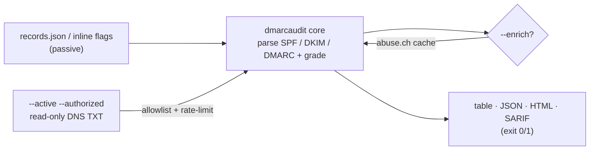

<a name="top"></a>

<div align="center">


# DMARCAUDIT

### Grade SPF / DKIM / DMARC posture & spoofability from DNS records

[](https://pypi.org/project/cognis-dmarcaudit/) [](https://github.com/cognis-digital/dmarcaudit/actions/workflows/ci.yml) [](https://github.com/cognis-digital/dmarcaudit/actions/workflows/ports.yml) [](LICENSE) [](tests/) [](https://github.com/cognis-digital)

*Part of the Cognis Neural Suite. Defensive, authorized-use email-security tooling.*

</div>

```bash
pip install cognis-dmarcaudit
dmarcaudit audit --input records.json    # → graded posture + prioritized findings
```

`dmarcaudit` answers one question precisely: **can someone spoof email from this
domain?** It parses the SPF, DKIM and DMARC TXT records you'd pull with
`dig TXT`, scores the domain 0–100 with a letter grade, lists the exact failure
modes worst-first, and tells you how to fix each one — as a **table**, **JSON**,
a self-contained **HTML report**, or **SARIF 2.1.0** for code-scanning/SIEM.

It is **passive and offline by default**: you feed it record strings (inline or
a captured DNS dump) and no network is touched. An **optional, authorization-
gated active mode** can resolve the records live over read-only DNS for a domain
you control or are explicitly authorized to assess (see
[Scope & authorization](#scope)).

## Usage — step by step

1. **Install** the CLI:
   ```bash
   pip install cognis-dmarcaudit
   ```

2. **Audit a domain's email-auth records** — pass SPF/DKIM/DMARC inline, or `--input` a JSON file:
   ```bash
   dmarcaudit audit --domain example.com \
     --spf "v=spf1 include:_spf.google.com -all" \
     --dmarc "v=DMARC1; p=reject; rua=mailto:dmarc@example.com; pct=100"
   ```

3. **Score posture from a records file** you exported elsewhere (a captured `dig` dump):
   ```bash
   dmarcaudit audit --input records.json
   ```

4. **Read the output.** Choose `table`, `json`, `html`, or `sarif`, and persist it with `--output`:
   ```bash
   dmarcaudit audit --domain example.com --format html --output dmarc.html
   ```

5. **Wire it into CI** to catch spoofability regressions — non-zero exit on HIGH+ or spoofable:
   ```bash
   dmarcaudit audit --input records.json --format json || exit 1
   ```

The `records.json` input format is exactly:

```json
{
  "domain": "example.com",
  "spf":   "v=spf1 include:_spf.google.com -all",
  "dmarc": "v=DMARC1; p=reject; rua=mailto:dmarc@example.com; pct=100",
  "dkim":  "v=DKIM1; k=rsa; p=MIIBIjANBgkq..."
}
```

Capture it for any domain you control with one line:

```bash
{ echo '{"domain":"example.com",'
  echo "\"spf\": \"$(dig +short TXT example.com | tr -d '\"' | grep -m1 spf1)\","
  echo "\"dmarc\": \"$(dig +short TXT _dmarc.example.com | tr -d '\"')\","
  echo "\"dkim\": \"$(dig +short TXT default._domainkey.example.com | tr -d '\"')\"}"
} > records.json
```

## Contents

- [Why dmarcaudit?](#why) · [Features](#features) · [Quick start](#quick-start) · [Worked example](#example) · [Output formats](#formats) · [Findings reference](#findings) · [Active mode](#active) · [Scope & authorization](#scope) · [Threat-feed enrichment](#enrich) · [Edge / air-gap](#edge) · [Demos](#demos) · [Language ports](#ports) · [Architecture](#architecture) · [AI stack](#ai-stack) · [How it compares](#how-it-compares) · [Integrations](#integrations) · [Install anywhere](#install-anywhere) · [Related](#related) · [Contributing](#contributing)

<a name="why"></a>
## Why dmarcaudit?

Grade SPF/DKIM/DMARC posture & spoofability from DNS records — without standing
up heavyweight infrastructure or sending a single email.

`dmarcaudit` is single-purpose, scriptable, and self-hostable: point it at
records you captured, get prioritized results in the format your workflow
already speaks (table · JSON · HTML · SARIF), gate CI on it, and let agents drive
it over MCP. The grading is deterministic and the rules map to the actual RFCs
(RFC 7208 for SPF, RFC 7489 for DMARC), so the score is explainable, not a black
box.

<div align="right"><a href="#top">↑ back to top</a></div>

<a name="features"></a>
## Features

- ✅ Parse **SPF, DMARC and DKIM** TXT records — fully offline (feed it a `dig` dump)
- ✅ Grade **spoofability 0–100** with a letter grade and prioritized findings
- ✅ Catches the real failure modes: `+all` pass-all, `p=none`, softfail,
  `>10` SPF lookups (RFC 7208), partial `pct`, `sp=none` subdomain gap,
  weak/forgeable DKIM keys, DKIM testing mode, missing `rua`
- ✅ Output as **table · JSON · HTML · SARIF 2.1.0** (`--format sarif` for
  GitHub code-scanning / SIEM ingest)
- ✅ **Non-zero exit** on HIGH+ or spoofable → drop-in CI / cron gate
- ✅ **Passive by default**; **optional authorized read-only active DNS** mode
  (`--active --authorized --allow <domain>`, rate-limited, TXT-only)
- ✅ **Threat-feed enrichment** (`--enrich`): cross-check SPF-authorized hosts
  against cached abuse.ch C2/abuse blocklists — keyless, offline, air-gap safe
- ✅ Eight runnable [demos](demos/) covering distinct real-world scenarios
- ✅ Runs on Linux/macOS/Windows · Docker · devcontainer · MCP server
- ✅ Real, verified [ports](ports/) in **Python, JavaScript, Go and Rust** —
  same finding codes, same JSON shape, same exit codes, all CI-tested
- ✅ 200+ test assertions across Python + the three ports

<div align="right"><a href="#top">↑ back to top</a></div>

<a name="quick-start"></a>
## Quick start

```bash
pip install cognis-dmarcaudit
dmarcaudit --version

# Audit inline records (no file needed):
dmarcaudit audit --domain example.com \
  --spf "v=spf1 include:_spf.google.com -all" \
  --dmarc "v=DMARC1; p=reject; rua=mailto:dmarc@example.com; pct=100"

# Audit a captured dig dump, in every format:
dmarcaudit audit --input records.json                  # graded table
dmarcaudit audit --input records.json --format json    # machine-readable
dmarcaudit audit --input records.json --format html -o report.html
dmarcaudit audit --input records.json --format sarif   # code-scanning / SIEM
dmarcaudit audit --input records.json || echo "posture needs work"  # CI gate
```

<div align="right"><a href="#top">↑ back to top</a></div>

<a name="example"></a>
## Worked example

```text
$ dmarcaudit audit --input demos/03-spf-passall/records.json
================================================================
 DMARCAUDIT  legacy-mailer.example
================================================================
 Grade      : F   (score 35/100)
 Spoofable  : YES — at risk
 SPF        : present  all=+all
 DMARC      : present  p=none
 DKIM       : MISSING
----------------------------------------------------------------
 Findings (4):
  [CRITICAL] SPF/SPF_PASSALL
      SPF ends in +all — ANY host on the Internet passes SPF for this domain.
      -> Replace +all with -all immediately.
  [HIGH    ] DMARC/DMARC_POLICY_NONE
      DMARC policy is p=none (monitor only). Spoofed mail is still delivered.
      -> Tighten to p=quarantine then p=reject.
  [MEDIUM  ] DKIM/DKIM_MISSING
      No DKIM record found for the supplied selector.
      -> Enable DKIM signing and publish the public key.
  [LOW     ] DMARC/DMARC_NO_RUA
      No aggregate report address (rua). You are blind to spoofing attempts.
      -> Add rua=mailto:dmarc-reports@<domain>.
================================================================
$ echo $?
1
```

The same audit as JSON (`--format json`) emits a structured `AuditResult` with
`domain`, `grade`, `score`, `spoofable`, the parsed `spf`/`dmarc`/`dkim` blocks,
and a `findings[]` array of `{severity, record, code, message, recommendation}`
objects — sorted worst-first — ready to pipe into jq, an LLM, or a SIEM.

<div align="right"><a href="#top">↑ back to top</a></div>

<a name="formats"></a>
## Output formats

| `--format` | Use it for | Notes |
|---|---|---|
| `table` (default) | humans / terminals | colorless, copy-pasteable |
| `json` | pipelines, agents, jq | full `AuditResult` shape |
| `html` | shareable report | single self-contained file, dark theme, grade badge |
| `sarif` | GitHub code-scanning, SIEM | SARIF 2.1.0; each finding → result, each code → rule, with `security-severity` |

Every format honors `--output / -o <path>`. Exit code is **non-zero** when the
domain is spoofable or any finding is HIGH or worse, so all four formats drop
straight into CI.

<div align="right"><a href="#top">↑ back to top</a></div>

<a name="findings"></a>
## Findings reference

| Code | Record | Severity | Meaning |
|---|---|---|---|
| `SPF_MISSING` | SPF | HIGH | No SPF record published |
| `SPF_PASSALL` | SPF | CRITICAL | `+all` — anyone on the Internet passes SPF |
| `SPF_SOFTFAIL` | SPF | MEDIUM | `~all` — unauthorized senders flagged, not rejected |
| `SPF_NEUTRAL` | SPF | HIGH | `?all` — no protection |
| `SPF_NO_ALL` | SPF | MEDIUM | no `all` mechanism (defaults to neutral) |
| `SPF_TOO_MANY_LOOKUPS` | SPF | HIGH | > 10 DNS lookups (RFC 7208) → PermError |
| `SPF_AUTHORIZES_ABUSE_IP` | SPF | HIGH | authorized IP on a cached abuse/C2 blocklist (`--enrich`) |
| `SPF_AUTHORIZES_ABUSE_DOMAIN` | SPF | HIGH | include/redirect on a cached abuse blocklist (`--enrich`) |
| `DMARC_MISSING` | DMARC | CRITICAL | no `_dmarc` record → From-header spoofable |
| `DMARC_POLICY_NONE` | DMARC | HIGH | `p=none` (monitor only) |
| `DMARC_QUARANTINE` | DMARC | LOW | `p=quarantine` (consider `p=reject`) |
| `DMARC_PARTIAL_PCT` | DMARC | MEDIUM | `pct<100` — policy applies to a fraction of mail |
| `DMARC_SUBDOMAIN_NONE` | DMARC | MEDIUM | `sp=none` — subdomains unprotected |
| `DMARC_NO_RUA` | DMARC | LOW | no aggregate report address |
| `DKIM_MISSING` | DKIM | MEDIUM | no DKIM key for the selector |
| `DKIM_WEAK_KEY` | DKIM | CRITICAL | key < 1024-bit — forgeable |
| `DKIM_1024_KEY` | DKIM | MEDIUM | ~1024-bit — deprecated |
| `DKIM_TESTING` | DKIM | LOW | `t=y` testing mode — failures may be ignored |

<div align="right"><a href="#top">↑ back to top</a></div>

<a name="active"></a>
## Active mode (optional, authorized-use, read-only)

By default dmarcaudit never touches the network. When you need to resolve a
domain's records live instead of capturing them by hand, the optional active
mode performs **read-only DNS TXT lookups** — the exact equivalent of
`dig TXT` — and feeds the result straight into the same offline grader.

```bash
# Resolve + grade a domain you are authorized to assess:
dmarcaudit audit --active --authorized \
  --allow example.com \
  --domain example.com \
  --rate 2 --format table
```

Active mode is deliberately and **non-negotiably bounded**:

- **OFF by default.** Requires both `--active` and `--authorized`.
- **Allowlisted targets only.** Every queried name must match `--allow`
  (repeatable) or the `DMARCAUDIT_ALLOW` env var; an off-list target is refused
  before any packet is sent.
- **Read-only.** Only DNS TXT queries (QTYPE 16). No mail is sent, no SMTP
  connection opened, no probe payload, no auth attempt — nothing that can alter
  the target.
- **Rate-limited.** A token bucket caps queries/second (`--rate`, default 2).
- **Stdlib only.** No third-party DNS library required, so it stays drop-in on
  minimal/edge hosts.

<div align="right"><a href="#top">↑ back to top</a></div>

<a name="scope"></a>
## Scope & authorization

dmarcaudit is a **defensive, authorized-use** tool. Passive analysis of records
you supply is always safe. Active mode is for assessing domains **you own or are
explicitly authorized to assess** — for example your own company's domains, or a
client's domains under a signed engagement. Do not point active mode at third
parties without written authorization. The allowlist, `--authorized` affirmation,
rate limit, and read-only TXT-only constraint exist to keep usage within those
bounds. See [SECURITY.md](SECURITY.md) and the
[COCL license](LICENSE).

<div align="right"><a href="#top">↑ back to top</a></div>

<a name="enrich"></a>
## Threat-feed enrichment

An SPF record that authorizes a host which is *already on a public abuse/C2
blocklist* is a real, actionable problem. With `--enrich`, dmarcaudit extracts
the IPs and include/redirect domains an SPF record authorizes and cross-checks
them against cached **abuse.ch** feeds (URLhaus, Feodo Tracker, ThreatFox),
adding `SPF_AUTHORIZES_ABUSE_IP` / `SPF_AUTHORIZES_ABUSE_DOMAIN` findings on a
real hit. No intel is fabricated — a finding fires only when a host matches an
entry in a feed you actually fetched/cached.

```bash
# One-time (or cron) refresh of the abuse feeds into the local cache:
python -m dmarcaudit.datafeeds update urlhaus feodo-c2 threatfox

# Then enrich any audit, purely from cache (offline):
dmarcaudit audit --input records.json --enrich

# Or refresh + enrich in one go (online):
dmarcaudit audit --input records.json --enrich --refresh-feeds
```

The ingester (`dmarcaudit/datafeeds.py`) and its catalog
(`dmarcaudit/data_feeds_2026.json`, 35 real, mostly-keyless feeds across vuln /
threat-intel / compliance / OSINT / cloud) are bundled, stdlib-only, and
disk-cached. List what's available:

```bash
python -m dmarcaudit.datafeeds list --domain threat-intel
```

<div align="right"><a href="#top">↑ back to top</a></div>

<a name="edge"></a>
## Edge / air-gap

The core audit is pure string analysis with **zero runtime dependencies**, so it
runs anywhere Python 3.10+ does — including disconnected, classified, or edge
gear. The threat-feed layer is designed for the same: feeds are fetched on a
connected box, cached to disk, and re-served **offline** so audits keep working
across an air gap. Move the cache by sneakernet:

```bash
# On a connected host — fetch and snapshot the feed cache:
python -m dmarcaudit.datafeeds update urlhaus feodo-c2 threatfox
python -m dmarcaudit.datafeeds snapshot-export feeds.tar.gz

# Inside the air gap — import once, then enrich offline forever:
python -m dmarcaudit.datafeeds snapshot-import feeds.tar.gz
dmarcaudit audit --input records.json --enrich          # cache-only, no network
```

The Go and Rust [ports](#ports) compile to a single static binary with no
runtime at all — ideal for dropping onto a minimal/edge host.

<div align="right"><a href="#top">↑ back to top</a></div>

<a name="demos"></a>
## Demos

Eight self-contained, runnable scenarios live in [`demos/`](demos/). Each folder
has a `records.json` (the tool's real input format — a captured `dig` dump) and
a `SCENARIO.md` explaining where the data came from, the exact command, what to
expect, and how to remediate. Every demo is verified by the test suite to fire
the findings it documents. The DKIM keys are **real** RSA public keys
(2048/1024/512-bit) generated locally — no fabricated key material.

| Demo | Scenario | Headline finding |
|---|---|---|
| [`01-basic`](demos/01-basic/) | "We have all three" but still spoofable | `DMARC_POLICY_NONE` (HIGH) |
| [`02-hardened-pass`](demos/02-hardened-pass/) | Correctly hardened gold-standard domain | none — grade A, exit 0 |
| [`03-spf-passall`](demos/03-spf-passall/) | Catastrophic `+all` (anyone can send as you) | `SPF_PASSALL` (CRITICAL) |
| [`04-spf-too-many-lookups`](demos/04-spf-too-many-lookups/) | SPF over the 10-lookup limit → PermError | `SPF_TOO_MANY_LOOKUPS` (HIGH) |
| [`05-dkim-weak-key`](demos/05-dkim-weak-key/) | Forgeable 512-bit DKIM key | `DKIM_WEAK_KEY` (CRITICAL) |
| [`06-partial-rollout`](demos/06-partial-rollout/) | DMARC deployment caught mid-flight | `DMARC_PARTIAL_PCT` + `sp=none` |
| [`07-parked-domain`](demos/07-parked-domain/) | Non-sending domain locked down correctly | spoofable: no |
| [`08-subdomain-takeover-vector`](demos/08-subdomain-takeover-vector/) | Strong policy undermined by `sp=none` | `DMARC_SUBDOMAIN_NONE` |

```sh
# Run any demo:
python -m dmarcaudit audit --input demos/03-spf-passall/records.json
# Export SARIF for code-scanning:
python -m dmarcaudit audit --input demos/03-spf-passall/records.json \
    --format sarif --output dmarc.sarif
```

(Regenerate the corpus with `python scripts/gen_demos.py`.)

<div align="right"><a href="#top">↑ back to top</a></div>

<a name="ports"></a>
## Language ports

The audit logic is ported across four languages so you can drop dmarcaudit into
any stack or ship a single static binary. All ports share the rule IDs, the JSON
output shape, and the CI exit-code contract. See [`ports/README.md`](ports/README.md).

| Language | Path | Run | Test |
|---|---|---|---|
| Python (reference) | [`dmarcaudit/`](dmarcaudit/) | `python -m dmarcaudit audit --input records.json` | `pytest` |
| JavaScript / Node | [`ports/javascript/`](ports/javascript/) | `node ports/javascript/index.js audit --input records.json` | `node ports/javascript/test.js` |
| Go | [`ports/go/`](ports/go/) | `cd ports/go && go run . audit --domain x.com --spf "v=spf1 +all"` | `go test ./...` |
| Rust | [`ports/rust/`](ports/rust/) | `cd ports/rust && cargo run -- audit --domain x.com --spf "v=spf1 +all"` | `cargo test` |

All ports are built and tested on every push by the
[`ports` CI workflow](.github/workflows/ports.yml) — real and continuously
verified, not vaporware, even if a given toolchain isn't installed locally.

<div align="right"><a href="#top">↑ back to top</a></div>

<a name="architecture"></a>
## Architecture



The core (`dmarcaudit/core.py`) is dependency-free and deterministic. Active DNS
(`active.py`) and feed enrichment (`feeds.py` + `datafeeds.py`) are strictly
optional layers that feed into — or annotate — the same offline grader.

<div align="right"><a href="#top">↑ back to top</a></div>

<a name="ai-stack"></a>
## Use it from any AI stack

`dmarcaudit` is interoperable with every popular way of using AI:

- **MCP server** — `dmarcaudit mcp` (Claude Desktop, Cursor, Cognis.Studio, [uncensored-fleet](https://github.com/cognis-digital/uncensored-fleet))
- **OpenAI-compatible / JSON** — pipe `dmarcaudit audit --input records.json --format json` into any agent or LLM
- **LangChain · CrewAI · AutoGen · LlamaIndex** — wrap the CLI/JSON as a tool in one line
- **CI / scripts** — exit codes + SARIF for non-AI pipelines

<div align="right"><a href="#top">↑ back to top</a></div>

<a name="how-it-compares"></a>
## How it compares

| | **Cognis dmarcaudit** | typical tools |
|---|:---:|:---:|
| Self-hostable, no account | ✅ | varies |
| Single command, zero config | ✅ | ⚠️ |
| Passive/offline by default | ✅ | ⚠️ |
| JSON + SARIF + HTML for CI | ✅ | varies |
| Authorization-gated active mode | ✅ | ⚠️ |
| Threat-feed enrichment (offline) | ✅ | ❌ |
| MCP-native (AI agents) | ✅ | ❌ |
| Polyglot ports (JS/Go/Rust) | ✅ | ❌ |
| Open license | ✅ COCL | varies |

<div align="right"><a href="#top">↑ back to top</a></div>

<a name="integrations"></a>
## Integrations

Pipes into your stack: **SARIF** for code-scanning, **JSON** for anything, an
**MCP server** (`dmarcaudit mcp`) for AI agents, a native
[`cognis-connect`](https://github.com/cognis-digital/cognis-connect) emitter
(`dmarcaudit-emit --to stix|misp|sigma|splunk|elastic|slack`), and a webhook
forwarder for SIEM/Slack/Jira. See [`docs/INTEGRATIONS.md`](docs/INTEGRATIONS.md).

<div align="right"><a href="#top">↑ back to top</a></div>

<a name="install-anywhere"></a>
## Install — every way, every platform

```bash
pip install "git+https://github.com/cognis-digital/dmarcaudit.git"     # pip (works today)
pipx install "git+https://github.com/cognis-digital/dmarcaudit.git"    # isolated CLI
uv tool install "git+https://github.com/cognis-digital/dmarcaudit.git" # uv
pip install cognis-dmarcaudit                                          # PyPI (when published)
docker run --rm ghcr.io/cognis-digital/dmarcaudit:latest --help        # Docker
brew install cognis-digital/tap/dmarcaudit                             # Homebrew tap
curl -fsSL https://raw.githubusercontent.com/cognis-digital/dmarcaudit/main/install.sh | sh
```

| Linux | macOS | Windows | Docker | Cloud |
|---|---|---|---|---|
| `scripts/setup-linux.sh` | `scripts/setup-macos.sh` | `scripts/setup-windows.ps1` | `docker run ghcr.io/cognis-digital/dmarcaudit` | [DEPLOY.md](docs/DEPLOY.md) (AWS/Azure/GCP/k8s) |

<div align="right"><a href="#top">↑ back to top</a></div>

<a name="related"></a>
## Related Cognis tools

**Explore the suite →** [🗂️ all 170+ tools](https://github.com/cognis-digital/cognis-neural-suite) · [⭐ awesome-cognis](https://github.com/cognis-digital/awesome-cognis) · [🔗 cognis-sources](https://github.com/cognis-digital/cognis-sources) · [🤖 uncensored-fleet](https://github.com/cognis-digital/uncensored-fleet) · [🧠 engram](https://github.com/cognis-digital/engram)

<div align="right"><a href="#top">↑ back to top</a></div>

<a name="contributing"></a>
## Contributing

PRs, new rules, demo scenarios, and language ports are welcome under the
collaboration-pull model — see [CONTRIBUTING.md](CONTRIBUTING.md) and
[SECURITY.md](SECURITY.md).

> ### ⭐ If `dmarcaudit` saved you time, **star it** — it genuinely helps others find it.

## Interoperability

`dmarcaudit` composes with the 300+ tool Cognis suite — JSON in/out and a shared
OpenAI-compatible `/v1` backbone. See **[INTEROP.md](INTEROP.md)** for the suite
map, composition patterns, and reference stacks.

## License

Source-available under the **Cognis Open Collaboration License (COCL) v1.0** —
free for personal, internal-evaluation, research, and educational use;
**commercial / production use requires a license** (licensing@cognis.digital).
See [LICENSE](LICENSE).

---

<div align="center"><sub><b><a href="https://cognis.digital">Cognis Digital</a></b> · one of 170+ tools in the <a href="https://github.com/cognis-digital/cognis-neural-suite">Cognis Neural Suite</a> · <i>Making Tomorrow Better Today</i></sub></div>
